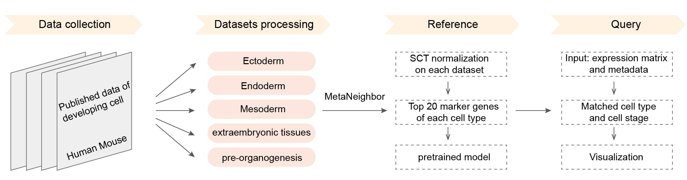

# README

dscBLAST: developmental single cell Basic Local Alignment Search Tool

We collected more than 160 datasets from approximately 50 articles. These data were grouped into five references: Ectoderm, Endoderm, Mesoderm, pre-organogenesis and extra-embryonic tissues. The correlation between query cells and reference cells is calculated using Metaneighbor. dscBLAST is particularly better at developing data, and it also performs very well on adult data.


## Workflow


## **Download**
click **[dscBLAST](https://github.com/Fuyt27/dscBLAST/archive/refs/tags/1.0.3.tar.gz)** or run this in the terminal:
```shell
wget https://github.com/Fuyt27/dscBLAST/archive/refs/tags/1.0.3.tar.gz
```


## **Install**
#### Package loading
Make sure the following packages are installed in your R-library before installing dscBLAST.
```R
library(MetaNeighbor)
library(Seurat)
library(SeuratObject)
library(SingleCellExperiment)
library(ggplot2)
library(igraph)
library(networkD3)
library(webshot)
library(pheatmap)
library(RColorBrewer)
library(reshape2)
library(dplyr)
library(stringr)
```

```R
install.packages('dscBLAST-1.0.3.tar.gz',repos=NULL,type='source')
```

## **Tutorial**

For demonstration purpose, we took the dataset **[ectoderm](https://github.com/Fuyt27/dscBLAST/releases/download/1.0.3/ectoderm.rds)** as example.


#### Data processing

- Detect MT genes
- Down-sample
  - default: 50000 cells
- Normalization
  - default: SCT transform
  - SCT transfrom(default) is sort of time-consuming. If your want to save time, please offer a normalized matrix and set  `mtx.type`='normalized' [default: 'raw']
- Create dscBLAST object

```R
library(dscBLAST)
#input data loading
seob<-readRDS('./ectoderm.rds')
count<-seob@assays$RNA@counts #input gene expression matrix
meta<-seob@meta.data #input metadata

#data processing
##generally we run dscblast in both human and mouse datasets(recommanded!), if you prefer to run dscblast for one species, please set ref_species ='single'.
## if you want to normalize your data depending on batch, please set `batch` ='your_batchname', which is expected to be offered in the meta data. This parameter would be take into account only when `mtx.type` is set as 'raw'.
## if the expression_matrix offered is normalized in advance, please set `mtx.type` = 'normalized'.
sce<-create_dscBLASTobject(expression_matrix = count,query_species= 'Hs',metadata = meta,cell_type=meta$cell_type,downsample = 20000,batch ='default',mtx.type = 'raw',ref_species ='both')
```


#### Run dscBLAST

```R
#run dscBLAST
auc <- RUN_dscBLAST(sce,query_species = 'Hs',reference = 'all',highlight_celltype=NULL)

##generally we run dscblast in all datasets, and it takes time. If the origin of query cells is known and you prefer to run dscblast using certain reference, please change the option `reference` ,for example:
auc <- RUN_dscBLAST(sce,query_species = 'Hs',reference = c('ecto','pre'),highlight_celltype=NULL)

## if you want to highlight certain cell types, please set `highlight_celltype`.  
auc_highlight <- RUN_dscBLAST(sce,query_species = 'Hs',reference = c('ecto','pre'),highlight_celltype='Melanocyte')
```

#### Check auc
```R
#get total auc 
auc_result <- auc[['auc_total']]

#get highlight auc 
auc_highlight_result <- auc_highlight[['auc_highlight']]

#save auc results in txt format(recommended)
library(data.table)
fwrite(auc_result,file = './auc_result.txt',quote = F,row.names = T,col.names = T,sep = '\t')
fwrite(auc_result,file = './auc_highlight.txt',quote = F,row.names = T,col.names = T,sep = '\t')
```


#### Visualization
Three forms of visualization are provided.

```R
#Sankey plot
Sanky_plot(auc,top_n = 3,cutoff = 0.8,use_shortname = T)

#Network plot
Network_plot(auc,top_n = 3,cutoff = 0.8,use_shortname = T)

#Heatmap plot
Heatmap_plot(auc,top_n = 3,cutoff = 0.8,use_shortname = T)

#if you want to show highlight cell types only,please set `highlight=T`.
Sanky_plot(auc_highlight,top_n = 3,cutoff = 0.8,highlight=T)

#if you want to define the query and ref celltype in the auc result matrix, please set  `custom.row` and `custom.col`.
custom.ref= c('Brain_Manno|Choroid plexus','Organogenesis_Cao|Ependymal cell','Eye_Han|Melanocyte','SKin_Reynolds|Melanocyte')
custom.query=c('Query|Choroid plexus','Query|melanocyte')
Sanky_plot(auc,custom.row = custom.ref,custom.col =custom.query,top_n = 3,cutoff = 0.8)
```


#### Marker

```R
# help to get markers from all datasets of a given species,for example:
marker_total <- getTotalMarkers(species ='Hs')
#if you only want to get markers from certain references.
marker_certain_reference <- getTotalMarkers(species ='Hs',reference = c('ecto','endo'))

# help to get markers from certain datasets and cell types,for example:
marker_certain_dataset_celltype <- getMarkers(species ='Hs',reference ='ecto' ,ref_celltype ='Melanocyte',ref_dataset ='Eye_Han' ,marker_top_n =20)

#Plot markers in your data
plotMarkers(sce,species = 'Hs',features = c('MLANA','TYRP1')) #Melanocyte markers
```


## Web-based interface
For more details, please visit our website **[dscBLAST](http://bis.zju.edu.cn/dscblast/index.html)**.


## Citation


## Contact
daiyuanliu@zju.edu.cn
